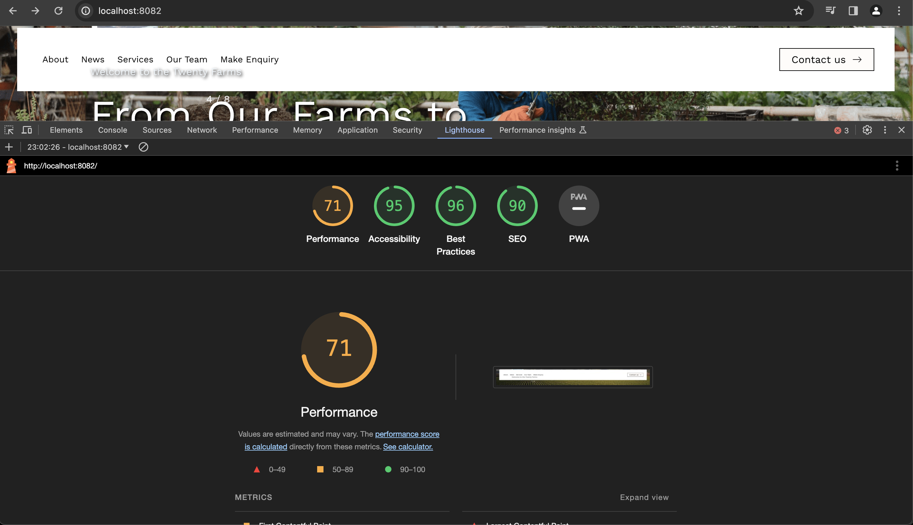

# Installation
In the project directory, you can run:

**npm install**

Installs all the node modules.

**npm run dev**

Runs the app in the development mode.
Open http://localhost:{port} to view it in browser.
The page will reload when you make changes.

# Packages used

# Library for slider
  Swiper : https://swiperjs.com/

# Best practices
1. Semantic HTML implemented in all components.
2. Images are compressed without impacting the quality.
3. BEM classes are used to reduce the css nesting after compilation.
4. Separate folders are created to categorise the data and component.
5. Component based styling implemented.
6. Used scss variables for colors and mixins for media query breakpoints.
7. Proper comments added in code.

# Performance
Using above best practices, performace report obtained is:

# To do:
1. Fix the position of thumbnail image slider on all devices. Apply border and move autoplay bar on outer border.
2. Implement fraction pagination as per design.
3. Fix banner slide effect as per the banner slider reference video: https://vimeo.com/806304396/9613ac1aba
4. Fix drag effect on image slider component as per reference video: https://vimeo.com/806273148/35db756bf7
5. Style hamberger icon on mobile devices as per design.
6. Convert all images in webp format to improve performance.
7. Install lint, prettier for error handling and formatting.

# Points to consider
1. Tried to make the webpage pixel perfect.
2. Could not fetch the spacing between few elements(such as space between hero banner section and text below it) in figma design. Thus, have implemented the spacings to make it visually same.
3. Created color variables for repeated color codes only.

